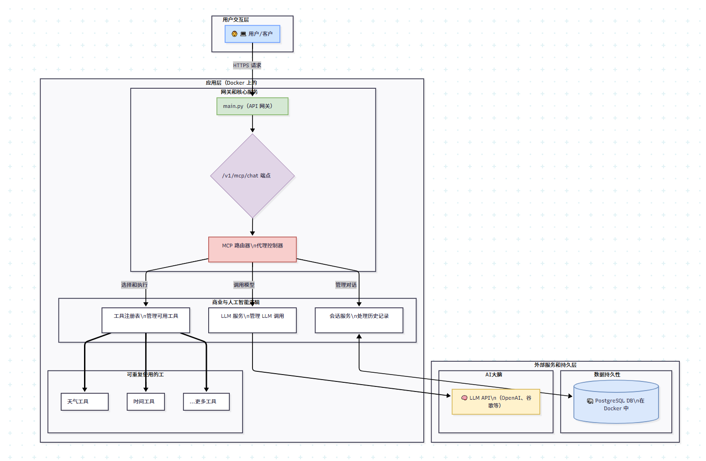

# 🔥 py-ai-core: AI智能体铸造厂 (AI Agent Foundry)

[](https://github.com/SolidFoundry/py-ai-core/actions)
[](https://www.python.org/)
[](LICENSE)
[](https://codecov.io/gh/SolidFoundry/py-ai-core)

一个基于 FastAPI 和 Docker 构建的、可扩展的、生产级的AI智能体（Agent）平台。本项目旨在探索和实践现代SaaS与业务场景下的AI应用工程化。

---

> **作者的话：**
>
> 作为一个深耕传统SaaS架构多年的技术人，我正走在全面拥抱AI应用工程化的转型之路上。这个仓库便是我这段旅程的实时记录与核心成果。
>
> 在这里，我将专注于解决AI技术落地时的真实工程挑战，致力于构建一个健壮、实用且文档完善的基础平台。项目中的实现或许尚有不足，但我会持续迭代优化。
>
> 欢迎任何友善的讨论、有建设性的反馈与潜在的合作。让我们一起在AI时代共同成长。

## ✨ 核心特性

- **🤖 生产级智能体引擎 (Production-Grade Agent Engine)**: 内置强大的 **ReAct** 模式 Agent 核心，使大语言模型（LLM）能自主决策并调用外部工具。同时支持基于**PostgreSQL**的有状态**多轮对话持久化**，为复杂的交互提供坚实基础。

- **🏗️ 全栈工程化与可观测性 (Full-Stack Engineering & Observability)**: 本项目致力于生产环境的最佳实践，内置了现代软件工程所需的全套工具链：
    -   **自动化测试**: 使用 **Pytest** 保证代码质量与功能稳定性。
    -   **持续集成/部署 (CI/CD)**: 通过 **GitHub Actions** 实现自动化构建、测试与部署流程。
    -   **日志与追踪**: 集成**分级的JSON格式日志**系统，并为每个请求注入`request_id`实现**全链路追踪**。
    -   **监控与运维**: 包含**接口请求耗时监控**与**/health健康检查**端点，保障系统稳定运行。

- **🚀 一键启动与容器化 (One-Command Startup)**: 使用 **Docker** 和 **Docker Compose** 将整个应用（服务+数据库）完全容器化，实现开发、测试与生产环境的**完全隔离和一致性**，极大简化了部署与协作流程。

- **🧩 模块化与高度可扩展 (Modular & Extensible)**: 遵循**高内聚、低耦合**的设计原则，清晰地分离了服务、工具和API路由。这使得添加**新的工具、服务乃至全新的业务模块**都变得简单高效，为复杂的业务场景提供支撑。

## 🛠️ 架构概览

`py-ai-core` 采用分层架构，旨在实现高内聚、低耦合，提升项目的可扩展性与可维护性。




## 🚀 快速开始 (Docker优先工作流)

*仅需一条命令，即可启动完整的应用栈。*

### 1. 先决条件
- Git
- Docker & Docker Compose

### 2. 环境设置
1.  克隆你的项目分支：
    ```bash
    git clone https://github.com/SolidFoundry/py-ai-core.git
    cd py-ai-core
    ```
2.  创建并配置你的环境文件：
    ```bash
    cp .env.example .env
    ```
    现在，请打开 `.env` 文件并填入你所需的API密钥。

### 3. 启动应用
```bash
docker-compose up -d --build
```
应用将启动在 `http://127.0.0.1:8000`。你可以通过访问 `http://127.0.0.1:8000/docs` 查看交互式的API文档。

## 🧪 运行测试
为确保所有功能正常，请在Docker环境中运行自动化测试：
```bash
docker-compose --profile test run --rm test test
```

## 🗺️ 未来路线图 (Roadmap)

本项目正处于活跃的开发阶段，以下是接下来计划实现的功能，以增强其能力：

- [ ] **高级RAG管线 (Advanced RAG Pipeline)**: 实现混合检索（Hybrid Search）与重排模型（Reranker），以显著提升信息检索的精准度。
- [ ] **多智能体协作 (Multi-Agent Collaboration)**: 探索并集成 CrewAI 或 AutoGen 等框架，以支持更复杂的、由多个专业智能体协作完成的工作流。
- [ ] **LLMOps集成 (LLMOps Integration)**: 增加对API成本、响应延迟和回答质量的监控，并实现对提示词（Prompts）和模型的版本化管理。
- [ ] **前端演示界面 (Frontend Demo)**: 使用 Streamlit 或 Gradio 构建一个简洁而强大的Web界面，以更直观地展示智能体的各项能力。

## 🤝 如何贡献

我们欢迎各种形式的贡献！无论是提交Bug报告、提出新功能建议、改进文档，还是直接贡献代码，我们都非常感谢。请查阅我们的 [贡献指南(CONTRIBUTING.md)](CONTRIBUTING.md) 以了解更多细节。

## 📄 开源许可证

本项目基于 MIT 许可证开源。详情请见 [LICENSE](LICENSE) 文件。
